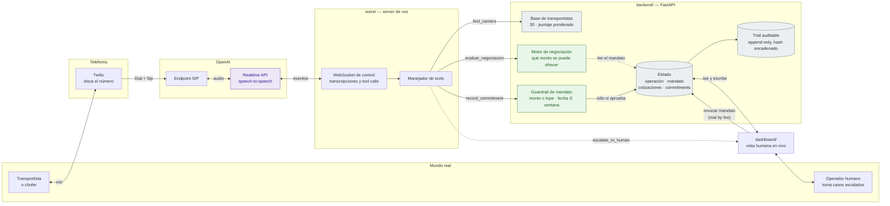
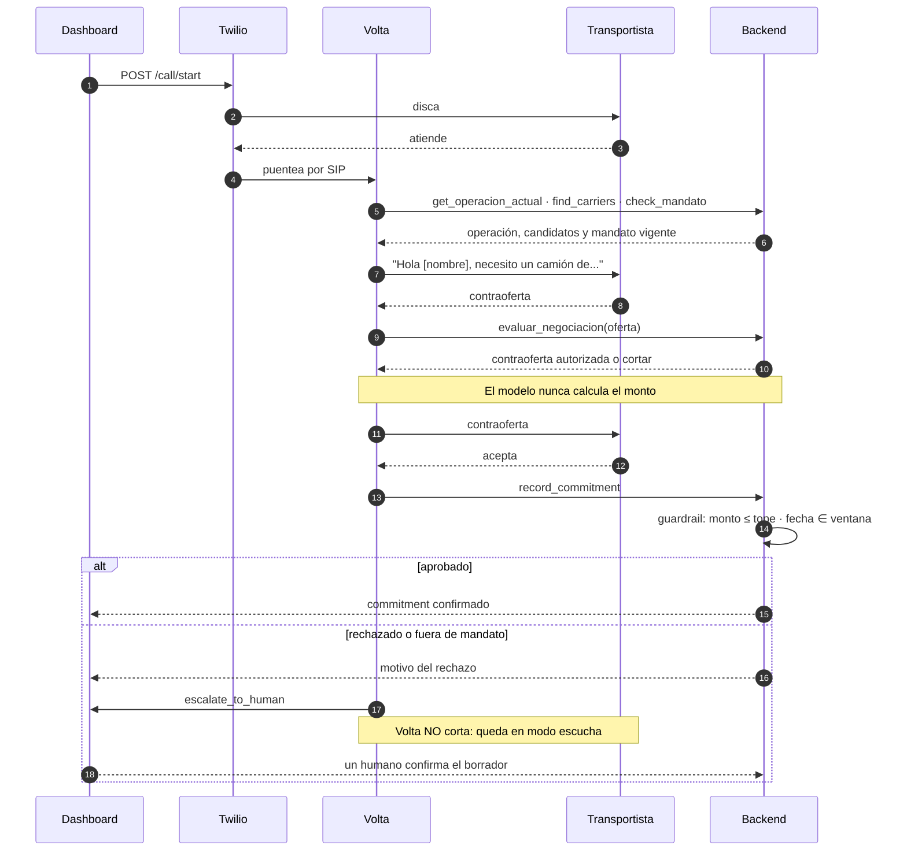

# Arquitectura — Volta

> Diagrama en Mermaid: GitHub lo renderiza solo y se edita como texto, sin
> reexportar una imagen cada vez que cambia algo. El PNG anterior
> (`arquitectura.png`) quedó del Bloque 2 y ya no refleja el sistema.

## El sistema

**Verde = decisiones que toma código, no el modelo.** Es el punto central del
diseño: el LLM decide *cómo* conversar, el código decide *qué* está permitido.

## Recorrido de una llamada

## Por qué SIP y no Media Streams

Las dos formas de conectar Twilio con un agente de voz:

| | Media Streams | **SIP** (lo que usamos) |
|---|---|---|
| Camino del audio | Twilio → nuestro server → OpenAI | Twilio → OpenAI, directo |
| Transcodificación | μ-law 8kHz en los dos sentidos, en tiempo real | ninguna |
| Latencia agregada | la de nuestro puente | ninguna |
| Nuestro WebSocket | transporta audio | sólo control: transcripciones y tool calls |
| Si nuestro server se cae | se corta el audio | la conversación sigue |

## El trial by fire

`POST /mandatos/{id}/revocar` revoca el mandato en vivo, desde el dashboard.
Funciona porque el agente vuelve a llamar a `check_mandato` **antes de cada
commitment**, no sólo al arrancar la llamada: una revocación a mitad de
conversación aterriza en el siguiente intento de cerrar, y el guardrail la
hace valer aunque el modelo ya hubiera aceptado de palabra.
